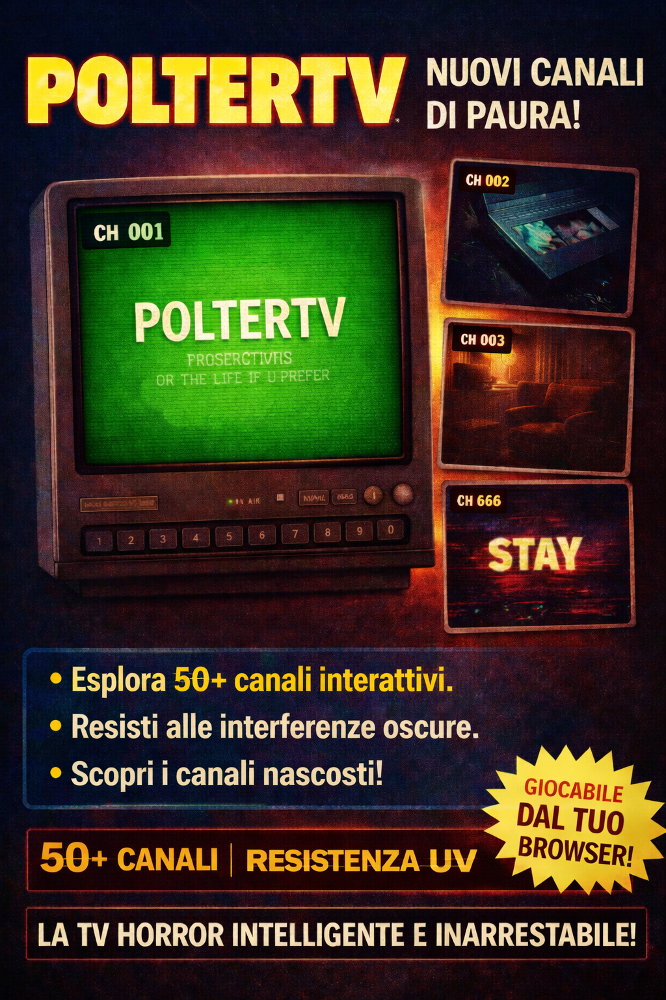

# POLTERTV

Una televisione interattiva in stile **retro analogico** che trasmette clip, glitch, interferenze e canali segreti.

Il progetto è stato pensato come esperienza immersiva per live streaming e community: una TV virtuale che gli spettatori possono esplorare cambiando canale, scoprendo contenuti nascosti e interagendo con una modalità live.




---

## Concept

POLTERTV simula una vecchia televisione analogica:

* cambio canali manuale
* glitch visivi e audio progressivi
* interferenze e anomalie che aumentano con il tempo
* canali nascosti
* overlay live con chat WORKING ON

L'obiettivo è creare qualcosa che sembri **una vera TV misteriosa trovata su internet**, non un semplice player video.

---

## Features

### Sistema Canali

* fino a **150 canali**
* navigazione con tastiera o controlli UI
* cambio canale con animazione analogica

### Canali Segreti

* canale speciale **666**
* glitch più intensi
* eventi visivi e audio anomali

### Sistema Glitch Progressivo

col passare del tempo:

* distorsioni video
* audio glitch
* interferenze
* corruzione dell'interfaccia
* eventi random

### Auto Channel

quando una clip termina:

* la TV passa automaticamente al prossimo canale

### Modalità LIVE

WORKING ON

apre una modalità fullscreen con:

WORKING ON

### Tastiera Retro 3D

WORKING ON

* è cliccabile
* reagisce ai tasti della tastiera reale
* permette di scrivere messaggi nella chat box locale

---

## Live Mode WORKING ON

La modalità LIVE mostra la diretta Twitch del canale


---

## Struttura progetto

```
poltertv
│
├── index.html
├── style.css
├── script.js
│
├── videos/
│   ├── ch01.mp4
│   ├── ch02.mp4
│   └── ...
│
└── assets/
    ├── favicon.png
    └── images
```

---

## Tecnologie

* HTML5
* CSS3
* Vanilla JavaScript
* Canvas API
* Twitch Embed API

Nessun framework utilizzato.

---

## Obiettivo del progetto

POLTERTV è pensato come esperienza per:

* live streaming
* contenuti community
* esperimenti audiovisivi
* intrattenimento interattivo

La TV può essere usata durante live stream per esplorare contenuti inviati dagli utenti.

---

## Autore

Michel Branche

Web Developer / Creative Projects

GitHub
https://github.com/MichelBranche

---

## Licenza

Progetto sperimentale per uso creativo e community. L'uso commerciale non é concesso. per utilizzare il prodotto é necessario dare i dovuti crediti di autore.


## Secret channel

 7, 3, 9, 1 


